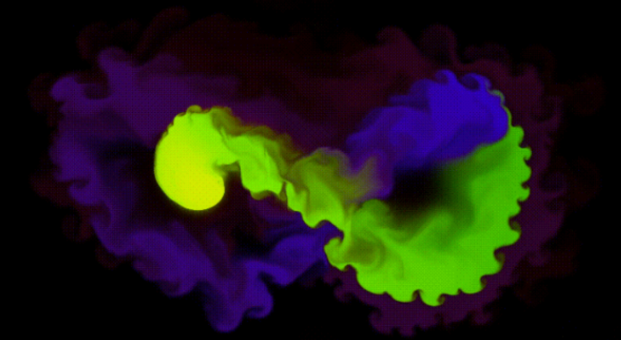
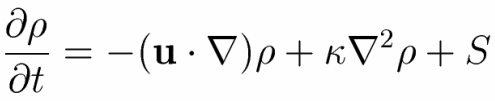
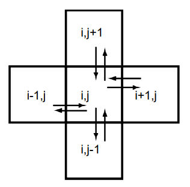
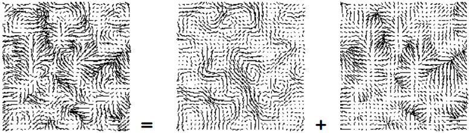
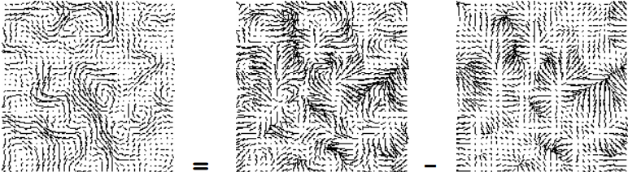
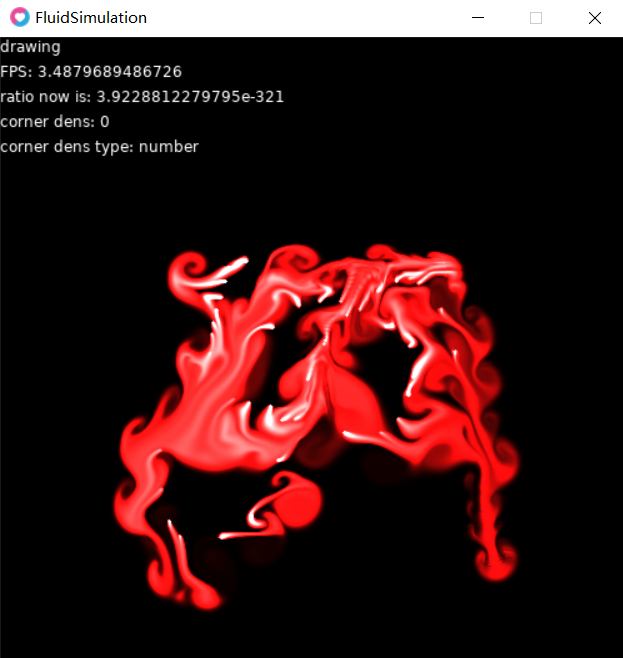

# 基于二维网格的流体动力学仿真
  
基于[GDC03](http://www.dgp.toronto.edu/people/stam/reality/Research/pdf/GDC03.pdf)和[navier](https://github.com/noahgibbs/navier)  
一开始帧率在两帧左右，试着减小了窗口，现在能跑到四帧。。。  
我将引擎本体（windows版本，如果是其他系统在[这里](https://love2d.org/)下载）和程序一同放在`FS`文件夹下，可运行程序见 `FS/FluidSimulation.exe`  
## LÖVE引擎
这个项目是由[LÖVE](https://love2d.org/wiki/Main_Page)，使用`lua`语言的2d游戏引擎完成，这个引擎本体也只有10M左右的大小，是个十分轻量级的引擎。  
其中，在LÖVE里主要的三个函数是
```
love.load()  -- 载入初始数据
love.update(dt)  -- 进行每一帧之间的计算，dt是帧与帧之间的间隔（秒）
love.draw()  -- 绘制结果
```
要对二维网格进行绘制，这里使用了自带的api: `love.graphics.points(points)`进行逐点（像素）绘制，对于`points`中`point`的格式为`{x, y, r, g, b, a}`。  
由于浓度浓度增长过快，衰减的值不好控制，流体的中心很容易就变白  
## 算法和思路
### 解析Navier_Stokes方程
  
流体密度的变化是由方程右边的三个项影响，第一项表示密度应该速率场变化，第二项表示扩散对密度带来的变化，第三项则是新的粒子浸入（粒子/密度增加）  
将它们在[func.lua](func.lua)中实现
```
function densities(d, d0, u, v, dt)  -- 流体的（粒子）密度变化
  d0, d = add_sourse(d, d0, dt)  -- 新的粒子加入
  d0, d = diffuse(0, d, d0, dt)  -- 粒子扩散
  d, d0 = advect(0, d, d0, u, v, dt)  -- 速率场影响下的变化
  for i = 1, (screen_width+2)*(screen_height+2) do  -- 衰减
    d[i] = d[i] * decay
  end
end
```
## 粒子的扩散 `diffuse(boundary, d, d0, dt)`   
  
如图，粒子与四周，即上下左右四个方向上的方格进行交换（扩散）  
`d[rn(i, j)] = d0[rn(i, j)] + a * (d[rn(i - 1, j)] + d[rn(i + 1, j)] + d[rn(i, j - 1)] + d[rn(i, j + 1)])`  
`a`是它的变化率，由扩散系数`diff`决定，再乘上扩散一次经过的时间`dt`和总的遍历一次数组需要的次数`screen_width * screen_height`即总时间  
如果扩散的率很大得不到好的仿真结果，于是这里在原来方法的基础上采用了高斯迭代的方法来获得更稳定的结果
## 速率场影响下的变化（平流输送）`advect(boundary, d, d0, u, v, dt)`
1. 从`u[],v[]`中获取速度并从初始坐标开始计算移动后的坐标  
2. 对超过二维数组（为了效率一直用一维数组来代替）范围的坐标取边缘值  
3. 以当前坐标和它四周像素边缘的值为输入，进行插值  
## 计算速率场的变化
前面解决了粒子密度的变化，但是流体中的速率场也会收到影响，所以也需要对速率进行计算。  
速率场变化的方法同密度的变化，速率场的变化也由速率场本身`advect()`、扩散`diffuse()`、新增速率值而带来变化`add_sourse()`，但需要对`u[],v[]`分别进行计算
```
function velocities(u, u0, v, v0, dt)  -- 速率场变化
  u0, u = add_sourse(u, u0, dt)  -- 新的速度变化加入
  v0, v = add_sourse(v, v0, dt)
  u, u0 = diffuse(1, u, u0, dt)  -- 速度发生扩散
  v, v0 = diffuse(2, v, v0, dt)
  u0, u, v0, v = project(u, u0, v, v0)
  u, u0 = advect(1, u, u0, u0, v0, dt)  -- 速率场在自身影响下的变化
  v, v0 = advect(2, v, v0, u0, v0, dt)
  u, u0, v, v0 = project(u, u0, v, v0)
end
```
## `project(u, u0, v, v0)`
速率场中新增的函数`project()`可以使速率场转化为`mass conserving`（质量守恒），`mass conserving`是流体很重要的一个特性，能使得流体产生我们常看到的漩涡  

----
  
`velocity field = mass coserving + gradiant field`  

----
用`Hodge decomposition`方法分解速率场，方程右边第一个图是我们想要的结果，即`mass conserving`，所以需要用速率场`velocity field`去减梯度场（高度场）`gradiant field`，如下图所示  

----
  
`mass coserving = velocity field - gradiant field`  

----
这里的算法是
1. 计算高度场（没看懂直接用了。。）
2. 我们想要的结果`mass coserving` = 速率场 - 高度场  
## `set_boundary(b, x)`  -- 设置反弹的边界  
一开始初始化参数的时候他们的大小就是(screen_width+2)*(screen_height+2)，是因为再他们的上下左右个加了一个边界，粒子遇到边界即刻反弹
1. 对于`x方向`的速率`u[]`和`y方向`的速率`v[]`以及密度`dens[]`不能以同样的方法来处理，比如`x方向`的速率在遇到上下的边界时，速度不会受到影响，要分别处理，于是设置了参数`b`
2. 当粒子到边界时，速率取与他相对方向的粒子速率的负值，即在这个地方发生了反弹
3. 四个角落的速率则用与他们相邻的方格的速率计算平均即可  
## Simulate
最后在`love.update()`中开始计算[main.lua](main.lua): line 41
```
  -- simulate
  dye(dens_prev)  -- 将粒子（浓度）注入，浓度为dens_val
  slide(u_prev,v_prev)  -- 获得鼠标滑动的速度
  velocities(u, u_prev, v, v_prev, dt)  -- 速率场变化
  densities(dens, dens_prev, u, v, dt)  -- 流体的（粒子）密度变化
```  
## 最后结果
